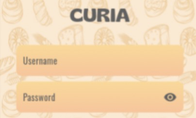

# CuriaApp

## Introduction

The CuriaApp is an app developed to simplify the process of reserving local produce. 



Managers can create a catalog of items with image, description and price, as well as which products are available in which days, and at which quantities, while clients can place orders that can be approved and marked as delivered by the managers.

The app has a classic backend frontend separation, where a single mobile app is used for both managers and clients as the frontend, and a specialized api is deployed in a server to handle all the data.


## Installation

### Dependencies 

You can install the project dependencies by doing:

```
pip install -r requirements.txt
```

### Backend

You can run our backend by doing:

```
cd backend
python app.py
```
### Backend

You can run our frontend by doing:

```
cd frontend
python main.py
```

## Credits

## Introduction

The Curia app was developed by Pedro Miguel Carvalho Lima, Luís Pedro de Sousa Oliveira Góis, Duarte José Antunes Silva, Tiago Henrique Aragão de Sousa and Gonçalo José Carrajola Gaio, for the Informatics Engineering Bachelor, as a project for the PGI course.